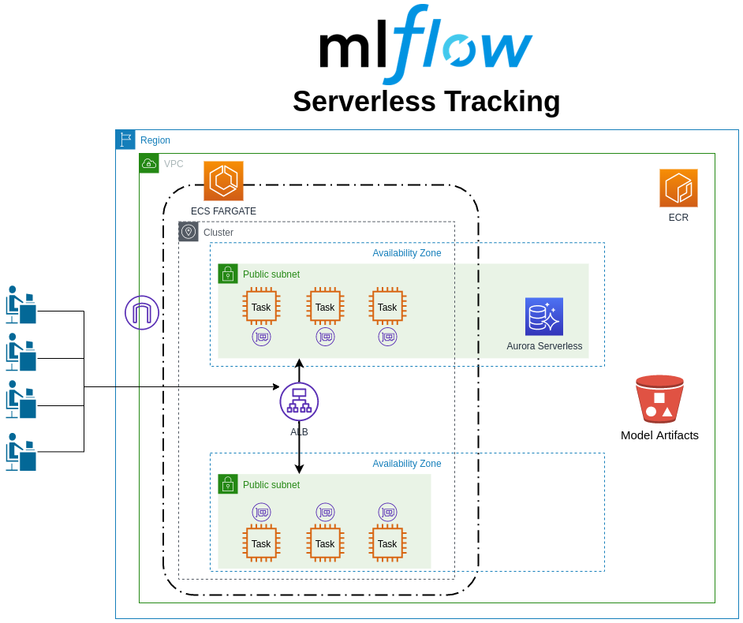

# MLFlow on AWS

This is a project to deploy MLFlow on AWS in a microservices architecture using ECS FARGATE and AURORA serverless DB. If you want to deploy MLFLow to a EC2 instance, check out the [ec2](https://github.com/neylsoncrepalde/mlflow-aws/tree/ec2) branch.

## Requirements

### AWS
* AWS IAM User for the infrastructure deployment, with admin permissions
* [awscli](https://aws.amazon.com/cli/), intall running `pip install awscli`
* [terraform >= 0.12](https://www.terraform.io/downloads.html)
* setup your IAM User credentials inside `~/.aws/credentials`

# Infrastructure design

This is what you are going to build.



# 1 - Build infrastructure on aws

First, you have to rename `config.tf.example` to `config.tf` and fulfill it with your real variables' values.

Use terraform to build the infrastructure:

```bash
cd infrastructure
terraform init
terraform plan
terraform apply
```

By default, the infrastructure is deployed in `us-east-1`.

# 2 - Build docker image and push to ECR

When the infrastructure is created, you will have build the docker image for MLFlow and push it to the created ECR repository. First you have to set up these environment variables:

```
export IMAGE=mlflow-dev
export AWS_ACCOUNT=<YOUR_ACCOUNT_NUMBER>
export AWS_ACCESS=<YOUR_AWS_ACCESS_KEY_ID>
export AWS_SECRET=<YOUR_AWS_SECRET_ACCESS_KEY>
export AWS_DEFAULT_REGION=us-east-1
export DB_PASS=<YOUR_MASTER_DB_PASSWORD>
export BUCKET_NAME=<YOUR_BUCKET_NAME>
export DB_ENDPOINT=<YOUR_DB_ENDPOINT>:3306
```

or you can set them inside .bashrc or in any manner you like.

Then, build the image and push it to ECR.

```bash
sh build_and_push.sh
```

After that, you can check your App Load Balancer DNS to access MLFlow's UI. Go to your browser and type `http://<YOUR_ALB_PUBLIC_DNS>`. 

To set mlflow experiments and runs to this tracking server, in your python code do

```python
mlflow.set_tracking_uri("http://<YOUR_ALB_PUBLIC_DNS>")
```

To start a new experiment or retrieve an old one, do

```python
if mlflow.get_experiment_by_name("EXPERIMENT_NAME") is None:
    mlflow.create_experiment("EXPERIMENT_NAME")
mlflow.set_experiment("EXPERIMENT_NAME")
```

That's it! Now you have an MLFlow tracking server running on AWS. If you need more computing power, you can easily configure a auto-scaling group within the service. 

# 3 - Clean up

If you want to clean up everything you created, just type:

```bash
terraform destroy
```

and `terraform` will do it's work! 

# To Do

This is a work in progress so there are a few things we would still like to improve:

- Put Aurora in a private subnet and configure routing.
