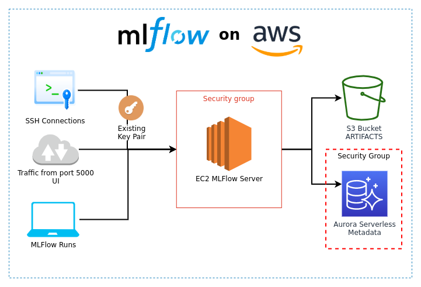

# MLFlow on AWS

This is a small project that I put together to help deploy and configure an MLFlow server on AWS speeding things up a little bit.

## Requirements

### AWS
* AWS IAM User for the infrastructure deployment, with admin permissions
* [awscli](https://aws.amazon.com/cli/), intall running `pip install awscli`
* [terraform >= 0.12](https://www.terraform.io/downloads.html)
* setup your IAM User credentials inside `~/.aws/credentials`

# Infrastructure design

This is what you are going to build.



# 1 - Build infrastructure on aws

Use terraform to build the infrastructure:

```bash
cd infrastructure
terraform init
terraform plan
terraform apply
```

By default, the infrastructure is deployed in `us-east-1`.

# 2 - Configure the server

When the infrastructure is created, you will have to log in to your ec2 instance and configure docker, 
build the image and start the container serving MLFlow. Open AWS console and find the instance PUBLIC DNS.
You can access the server with the command:

```bash
ssh -i "<YOUR_KEY_PAIR>.pem" ubuntu@<YOUR_EC2_PUBLIC_DNS>
```

Don't forget to substitute YOUR_KEY_PAIR and YOUR_EC2_PUBLIC_DNS for you actual key pair and public DNS.

Once inside the server, first, we will clone the repo and use `install_docker.sh` to 
update the OS and install docker.

```bash
git clone https://github.com/neylsoncrepalde/mlflow-aws.git
cd mlflow-aws
sh install_docker.sh
```

When the installation is ready, you have to log out and log back in so ubuntu user has docker permissions.

```
exit
```

and then

```
ssh -i "<YOUR_KEY_PAIR>.pem" ubuntu@<YOUR_EC2_PUBLIC_DNS>
```

again.

# 3 - Build the image and start the container

Now, you have to set up some important environment variables for it to run. You can use export command

```
export IMAGE=mlflowserver
export AWS_ACCESS=<YOUR_AWS_ACCESS_KEY_ID>
export AWS_SECRET=<YOUR_AWS_SECRET_ACCESS_KEY>
export DB_PASS=<YOUR_MASTER_DB_PASSWORD>
export BUCKET_NAME=<YOUR_BUCKET_NAME>
export DB_ENDPOINT=<YOUR_DB_ENDPOINT>:3306
```

or you can set them inside .bashrc or in any manner you like.

Then, build the image and start the container with

```bash
cd mlflow-aws
sh build_and_push.sh
```

Go to your browser and type http://<YOUR_EC2_PUBLIC_DNS>:5000. MLFlow server will be listening on port 5000. 

To set mlflow experiments and runs to this tracking server, in your python code do

```python
mlflow.set_tracking_uri("http://<YOUR_EC2_PUBLIC_DNS>:5000")
```

To start a new experiment or retrieve an old one, do

```python
if mlflow.get_experiment_by_name("EXPERIMENT_NAME") is None:
    mlflow.create_experiment("EXPERIMENT_NAME")
mlflow.set_experiment("EXPERIMENT_NAME")
```

That's it! Now you have an MLFlow server running on AWS. If you need more computing power, you can scale your instance vertically 
(add more CPU and RAM) or you can save an AMI (customized image) and configure a load balancer and an auto-scaling group. 

Prof. Neylson Crepalde
